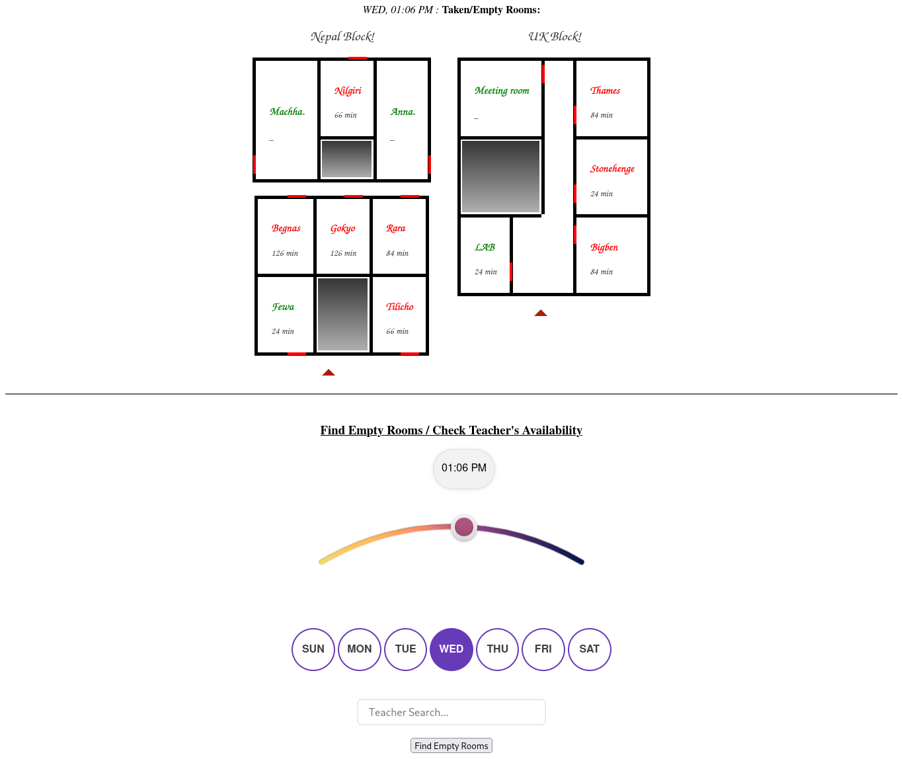
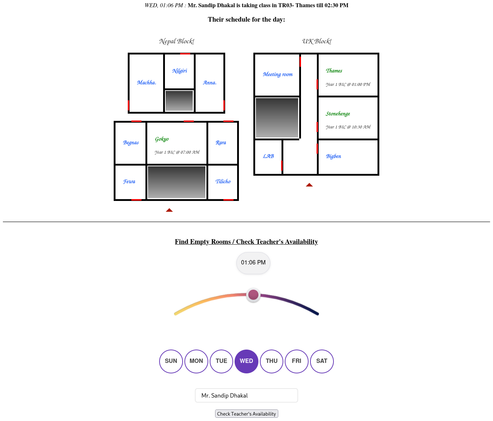
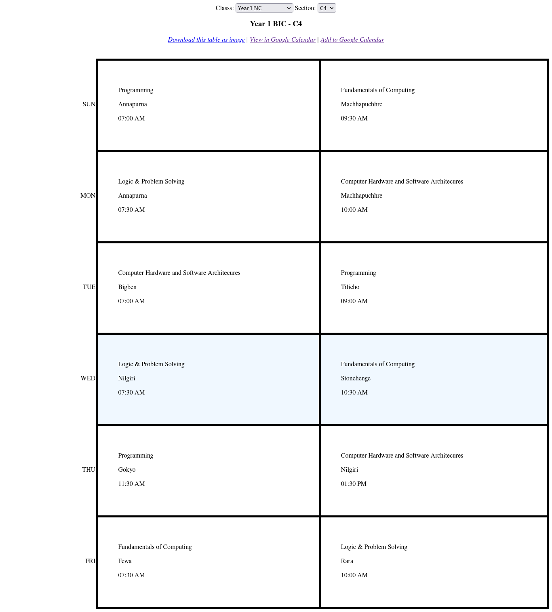
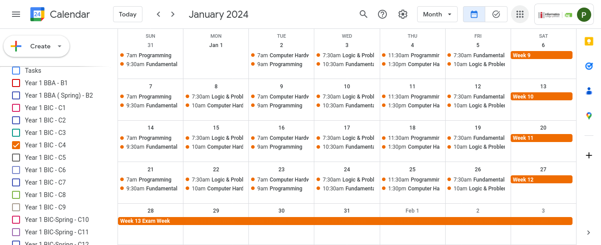

### Prepare
1. download credentials.json file from Google Cloud Project as mentioned [here](https://developers.google.com/calendar/api/quickstart/python)
2. pip install requirements.txt (preferably inside a venv)

### INFO
- **sched_1.py**:  
_Extract data from xlsx file so that they can be statically typed in other codes. This avoids re-reading the source xlsc file every time. Saves time._
- **sched_2.py**:   
*Requred user to enter correxponding week1 dates for each year, holiday dates, exam week range manually from AcademicCal.xlsx. It then uses google calendar api to create calendar for each section of each year (to be run only once then statically type the cal_ids data for future use), add classes, remove classes on holidays, add week number on each saturday, add exam weeks, reassesments, semester breaks.*
- **serv.py**:  
*Runs http server with SimpleHTTPRequestHandler on port 10009. Accepts post request with optional data: day, time, teacher name.* 
    -   If teacher name not provided, returns `{"empty_rooms":[{"<room_name>":<x:free for x min>},..],"taken_rooms":[{"<room_name>":<x:busy for x min>},..]}`
    -   If teacher parameter provided, returns 
    `{"room": "<room_name if teacher has class at given time else null>", "time":"<time else null>", "schedule": [["<room_name>", "<year>", "<time>"],..]}`
- **icp_map.html**: 
    * Search Empty/Busy class at given time/day. 
    
    * Get teacher's availability and schedule.
    
- **icp_cal.html** 
    * Get class schedule table for each class 
    
    * with link to corresponding google calendar
    